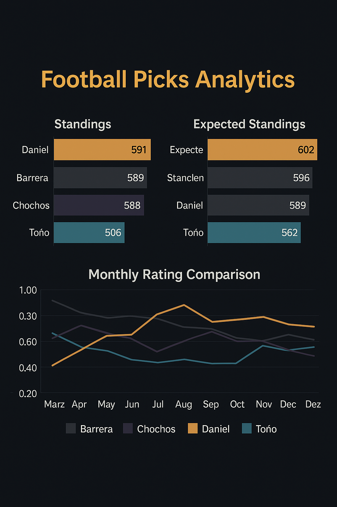

# ⚽ Football Picks Analytics &nbsp;    

  

A personal project aimed at analyzing data, generating statistics, and creating visualizations based on a friendly competition inspired by the question: **"Who has the best intuition for football?"**  
The objective is to develop analytical tools to compare participants' predictions and assess their performance using various metrics, such as points by category, efficiency ratings, and expected points.

This project showcases my practical ability to extract meaningful and comprehensive insights by applying the full data analysis process — from data extraction, cleaning, and transformation to the design of impactful and intuitive visualizations tailored to a target audience.

It is based on a real-life use case with engaging and playful data, which allows me to refine my technical skills through the integration of multiple data analysis tools. For its development, I used **Google Sheets, Excel, and BigQuery** to store, extract, clean, and transform the data, and **Tableau** and **R** (in both **Visual Studio Code** and **RStudio**) to analyze the data and produce dashboards and visualizations.

---

## 🧰 Technologies and Tools

- **Programming languages:** R, SQL  
- **Main R libraries:** `dplyr`, `ggplot2`, `httpgd`, `tidyr`, `readr`, `lubridate`  
- **Development environments:** Visual Studio Code, RStudio  
- **Version control:** GitHub (integrated with Visual Studio Code)  
- **Spreadsheet editors:** Google Sheets, Microsoft Excel  
- **Data visualization tools:** Tableau, Visual Studio Code (R)

---

## 📁 Project Structure

- **Football-picks-analytics/**
  - **data/**
    - `raw/` – Original CSV data files
    - `processed/` – Cleaned datasets and calculated metrics
  - **scripts/** – R and SQL scripts for analysis and visualization
  - **outputs/** – Final plots and dashboards
  - `README.md` – Project description and documentation

---

## 📊 Key Results

By comparing players’ performance, I was able to:
- Identify correlations between participation frequency and total points.
- Determine which tournaments and match categories attract the most attention.
- Detect which match results are easier to predict.
- Understand what features influence players' choices when submitting predictions.

---

## 🧠 Key Learnings and Skills Developed

- Data loading and management using Microsoft Excel and Google Sheets  
- Data extraction and transformation with BigQuery (SQL), RStudio, and Visual Studio Code (R)  
- Statistical analysis and synthesis of comprehensive insights  
- Creation of impactful and intuitive data visualizations using R and Tableau  
- Process automation through scripting  

---

## 🔄 Next Steps

As a practice-focused and ongoing project, it is constantly evolving:
- Discover new patterns by combining current data with 2025 competition results to enrich trend analysis.
- Strengthen my existing skill set by developing interactive interfaces with **Shiny** and predictive models to anticipate player performance.
- Expand my technical portfolio by incorporating **Python** and **Power BI**.
- Extend the project to analyze additional sports and competitions.

---

## 👤 About Me

I'm **Fernando Barrera**, an international relations graduate deeply passionate about both **data analysis** and **football**. This project is a way to merge these interests and create engaging, insightful, and data-driven storytelling.

- 💼 LinkedIn: [Joaquin Barrera](https://www.linkedin.com/in/-joaquin-barrera-/)  
- 🧪 Portfolio: [GitHub](https://github.com/Joaquin-Barrera-Flores) | [Kaggle](https://www.kaggle.com/fjoaquinbarreraf)  
- 📬 Email: fernando.joaquin.barrera.flores@gmail.com
